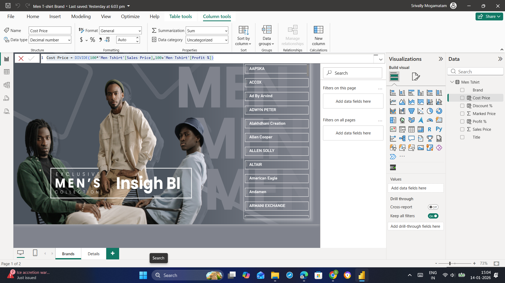
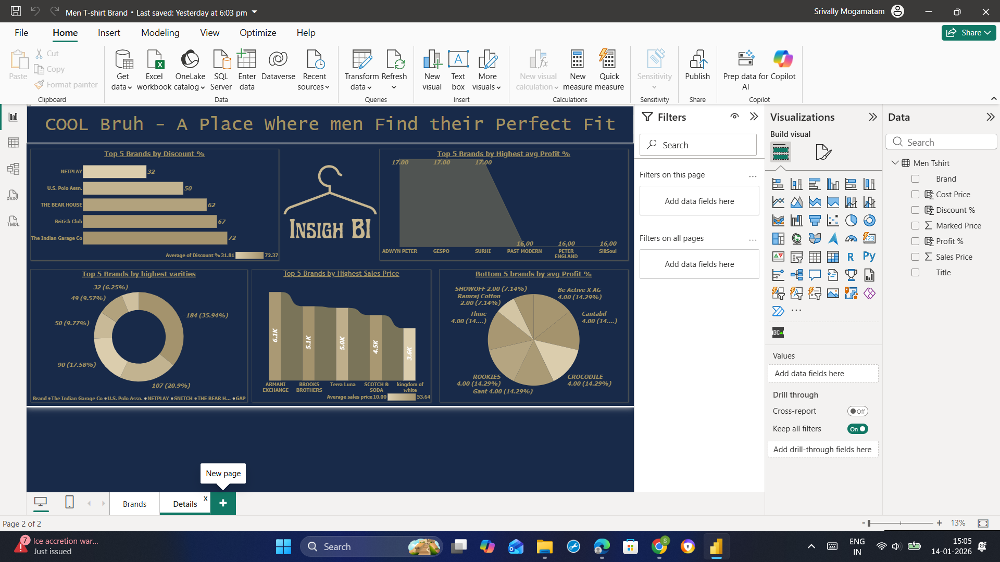

# T-shirt-Brand-Project

# 👕 Men’s T-Shirt Brand Sales & Profit Analysis Using Power BI

---
### Dashboard Link

https://app.powerbi.com/groups/22850eec-0469-4673-85a2-06ad0aecd3c6/reports/8ed57196-8737-44e1-a2dd-e44b9d7aa454/5cfe23e9e054c1007b7a?experience=power-bi


## 📊 Dashboard Overview

This project analyzes **men’s T-shirt brand performance** to understand **pricing strategy, discount patterns, profit margins, and brand-wise sales behavior**.  
The dashboard helps retail stakeholders evaluate **available brands**, identify **top and bottom performers**, and optimize **pricing and profitability strategies**.

---

## 🧩 Problem Statement

Retail businesses need to strike the right balance between **discounts, pricing, and profit margins** while staying competitive.  
This project aims to analyze men’s T-shirt brand data to:

- Analyze **only available brands** in the dataset  
- Identify **top and bottom brands based on discounts and profit %**  
- Compare **sales price, cost price, and marked price**  
- Understand **brand-wise variety and pricing strategy**

The insights support **better pricing decisions, improved profitability, and strategic brand positioning**.

---

## 🛠 Tools & Technologies Used

- Azure SQL Database  
- SQL (Data Cleaning & Transformation)  
- Power BI Desktop  
- Power BI Service  
- Power Query Editor  
- DAX (Data Analysis Expressions)  

---

## 📂 Dataset Information

- **Men Tshirt.csv**
- Key columns:
  - Brand  
  - Sales Price  
  - Original Price  
  - Marked Price  
  - Discount %  
  - Profit %  
  - Cost Price  

---

## 🔄 Data Cleaning & Preparation (Azure SQL)

The dataset was initially cleaned at the **Azure SQL Database** level.

### SQL Data Cleaning Queries

```sql
UPDATE [dbo].[Men Tshirt]
SET original_price = TRIM(REPLACE(CAST(original_price AS VARCHAR(MAX)), '?', ''))
WHERE original_price LIKE '%?%'
````

```sql
UPDATE [dbo].[Men Tshirt]
SET sale_price = TRIM(REPLACE(CAST(sale_price AS VARCHAR(MAX)), '?', ''))
WHERE sale_price LIKE '%?%'
```

---

## 🔄 Power BI Data Preparation

* Imported data into **Power BI Desktop** using Azure SQL Database
* Replaced **NA values** with most frequent values
* Corrected **data types**
* Created a **conditional column** as a factor
* Created a **custom column**: `sales * factor`
* Created a **conditional column**: `Marked Price`
* Deleted intermediate columns:

  * factor
  * original_price
  * sales * factor
* Renamed `sale_price` to **Sales Price**
* Loaded the final cleaned dataset

---

## 📐 Calculated Columns (DAX)

### Discount Percentage

```DAX
Discount % =
DIVIDE(
    'Men Tshirt'[Marked Price] - 'Men Tshirt'[Sales Price],
    'Men Tshirt'[Marked Price]
) * 100
```

### Profit Percentage

```DAX
Profit % = RANDBETWEEN(2, 17)
```

### Cost Price

```DAX
Cost Price =
DIVIDE(
    100 * 'Men Tshirt'[Sales Price],
    100 + 'Men Tshirt'[Profit %]
)
```

---

## 📊 Dashboard Pages Overview

### 📄 Page 1 – Brand Overview

* Displays **only the available brands** present in the dataset
* High-level brand overview for pricing and profitability
* KPI visuals summarizing brand performance
* Interactive filters to analyze brand availability dynamically

---

### 📄 Page 2 – Details (Brand Performance KPIs)

This page provides detailed brand-level insights using the following KPIs:

* **Top 5 Brands by Discount %**
* **Top 5 Brands by Highest Average Profit %**
* **Top 5 Brands by Variety Count**
* **Top 5 Brands by Highest Sales Price**
* **Bottom 5 Brands by Average Profit %**

A **scrolling text visual** is used in the header to enhance dashboard usability and presentation.

---

## 📸 Dashboard Snapshots

### Page 1 – Brand Overview



### Page 2 – Brand Details



---

## 🔍 Key Insights

* Only **available brands** are included in the analysis
* Some brands offer **high discounts** but operate on **lower profit margins**
* Premium brands maintain **lower discounts with higher sales prices**
* A small group of brands dominates **product variety**
* Bottom-performing brands consistently show **low average profit %**
* Cost price calculation highlights **pricing efficiency and margin control**
* Discount strategies vary significantly across brands

---

## 🚀 Deployment

* Dashboard built using **Power BI Desktop**
* Ready for publishing to **Power BI Service**
* Data sourced directly from **Azure SQL Database**

---

## ✅ Conclusion

This project demonstrates an **end-to-end retail analytics solution** using Azure SQL and Power BI.
It showcases how **SQL-based data cleaning, DAX calculations, and interactive dashboards** can help analyze brand-level pricing strategies, discounts, and profitability.

---


